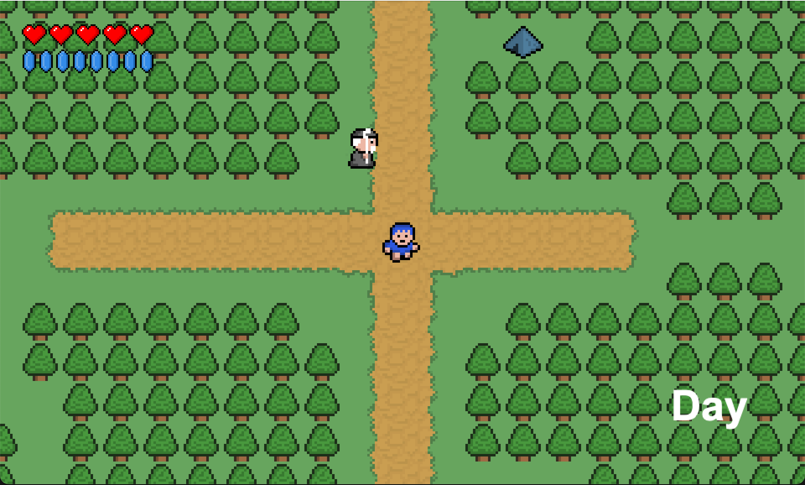

# Blue Boy Adventure

  

## 🎮 About the Game  
**Blue Boy Adventure** is a 2D adventure game where you explore, fight monsters, interact with NPCs, and collect items. You control a player navigating a pixel-art world, battling foes like orcs and skeleton lords while equipping weapons and shields.  

## 🚀 Features  
- **🌍 Exploration** – Traverse a pixel-art world filled with NPCs and enemies.  
- **⚔️ Combat System** – Fight enemies like orcs and skeleton lords using melee attacks.  
- **🛡️ Equipment** – Collect weapons, shields, and potions to enhance your abilities.  
- **🎨 Pixel Art** – Enjoy a retro-inspired 2D game aesthetic.  
- **💾 Save & Load** – Progress is stored so you can continue your adventure anytime.  

## 🕹️ Controls  
- **Arrow Keys / WASD** – Move  

- **Spacebar** – Defend  
- **Enter** – Attack 
- **F** – Fireball 

- **C** – Inventory
- **P** – Pause
- **M** – Map
- **X** – Minimap

- **ESC** – Open Menu  
- **T** – Debug 

## 🛠️ Installation & Running the Game  
### Prerequisites  
- Add **later**

## 🎥 Credits  
[RyiSnow Tutorial](https://www.youtube.com/playlist?list=PL_QPQmz5C6WUF-pOQDsbsKbaBZqXj4qSq)